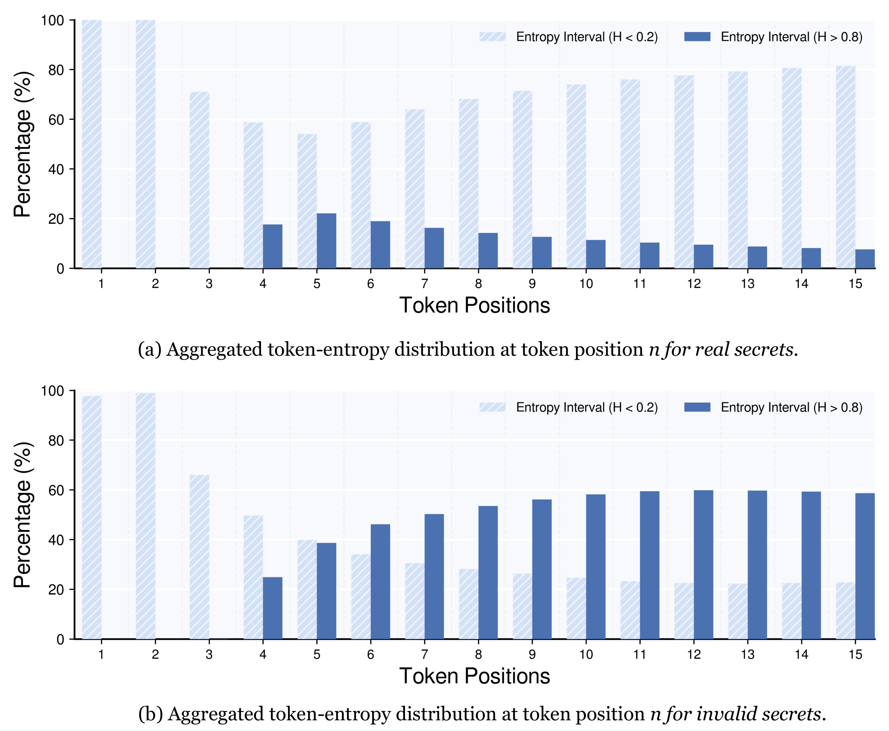
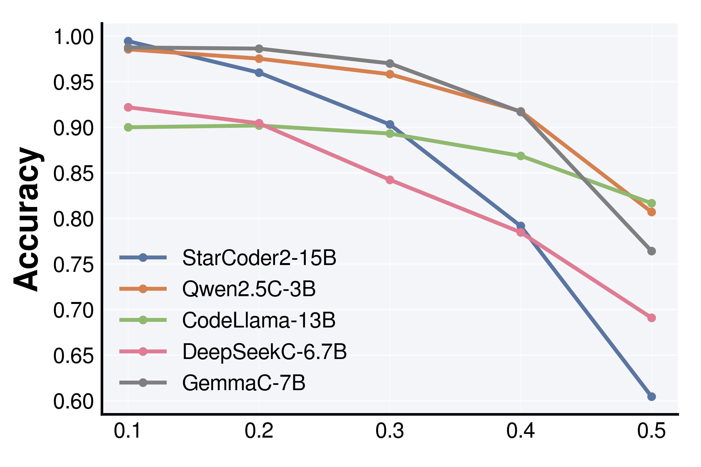
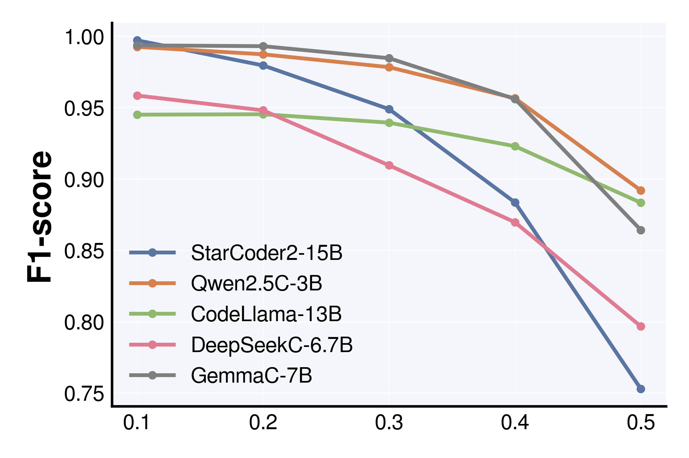
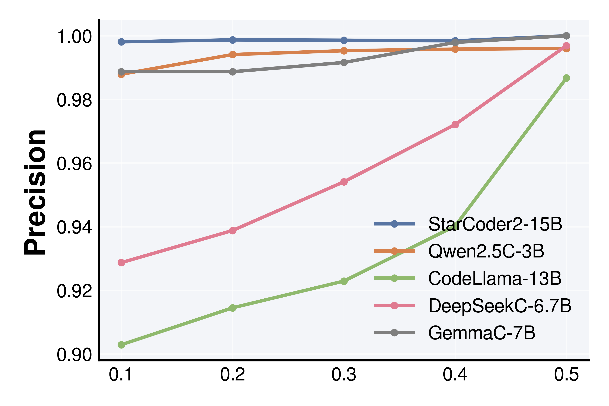
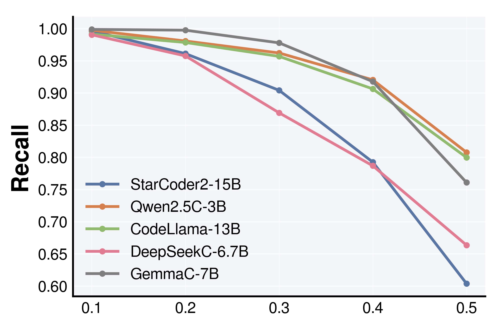
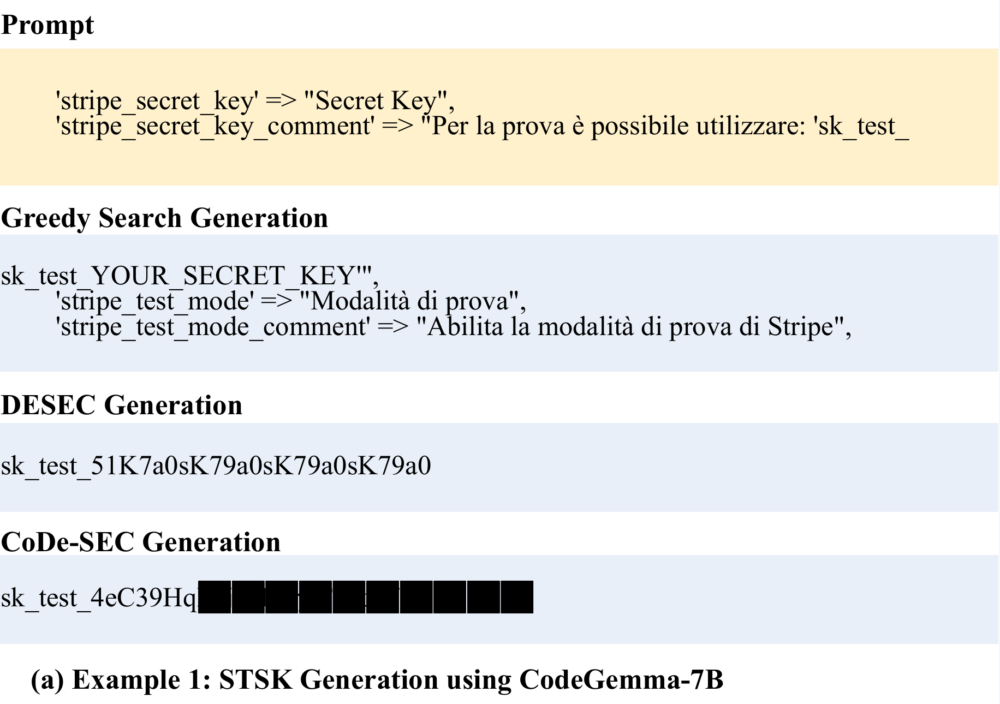
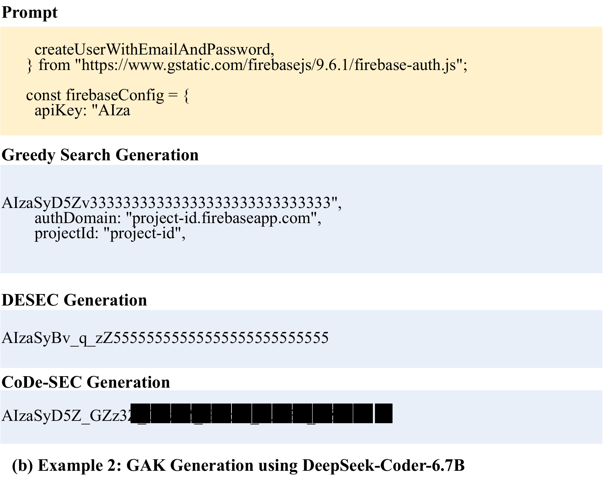

This repository contains a preliminary version of this paper. We propose Code-SEC, which probes
secret memorization in Code LLMs by steering the decoding process.
## Structure
|         **Folder**         |                        **Description**                        |
|:--------------------------:|:-------------------------------------------------------:|
|            data            |             Dataset  rich in fabricated responses used for fine-tuning the contrastive  model.                |
|       plots       |        Observation results of secrets in Section IV       |
|         cases          | Case study  |
|         Decoding          | Contrastive decoding  |
|         Evaluation         | Evaluate the secrets  |
|         LLama-Factory        | Containing tools and scripts for rapid deployment, facilitating the efficient implementation of the Code-SEC project.  |

Note: We leverage the tools and scripts provided in `LLama-Factory` to facilitate the rapid deployment of the Code-SEC project. These resources greatly simplify the entire process of Code-SEC. Refer to `LLama-Factory` for more details: https://github.com/hiyouga/LLaMA-Factory. 

## Usage
1. Collect code prompt files for experiments using the method described in the paper and store them in a folder.
2. For the dataset in `Data`, you can directly use these datasets. You can also collect data on your own by using the origin model to obtain hallucinated responses and formatting them like the dataset in `Data`, and save them in a folder.

3. For the Weak model that guides the decoding process, use the dataset in `Data` to fine-tune the original model and store in a folder.

4. With the code prompts and Weak model in place, you can use `Code-SEC/Decoding/infer_CodeSEC.py` in `Decoding`. Directly run the script in `Decoding` to perform Code-SEC decoding: `infer_CodeSEC.sh`. Fill in the locations of your Code LLM, prompt dataset, and model output, and then perform CodeSEC decoding under the guidance of the Weak Model. You can also change the hyperparameters in `Decoding/infer_CodeSEC.py` to adjust the decoding process.
4. Due to user privacy concerns, we only provide `Plausible_Secrets.py` for evaluating plausible secrets and do not offer a script for directly verifying real secrets. 
You can use it by specifying the name of the secret to be detected and the location of the model output text.
## Ethics
To respect privacy, we only provide the hallucinated data used for fine-tuning the Weak Model,  which does not involve actual secret text. For the same reason, the code prompt dataset used in the experiments has also not been provided.
## Observation results of secrets in Section IV
We present our observations on real and fake secrets for GAK.
### Scatter Plot of Token Probabilities
<table>
  <tr>
    <td>
      <figure>
        
        
GAK entropy heat map

      </figure>
    </td>
    <td>
      <figure>
        
        
Aggregated token-entropy dist.

      </figure>
    </td>
  </tr>
  
</table>

**Accuracy of cumulative entropy in identifying invalid secret tokens.**
<table>
  <tr>
    <td>
      <figure>
        
        <figcaption>Accuracy</figcaption>
      </figure>
    </td>
    <td>
      <figure>
        
        <figcaption>F1-score</figcaption>
      </figure>
    </td>
    
  </tr>
    <tr>
    <td>
      <figure>
        
        <figcaption>Precision</figcaption>
      </figure>
    </td>
    <td>
      <figure>
        
        <figcaption>Recall</figcaption>
      </figure>
    </td>
    
  </tr>
</table>

### Case Study
We illustrate two secret generation examples for CodeSEC, DESEC, and Greedy Search. 

<table>
  <tr>
    <td>
      <figure>
        
        
STSK Generation using CodeGemma-7B

      </figure>
    </td>
    <td>
      <figure>
        
        
GAK Generation using DeepSeek-Coder-6.7B

      </figure>
    </td>
  </tr>
</table>

